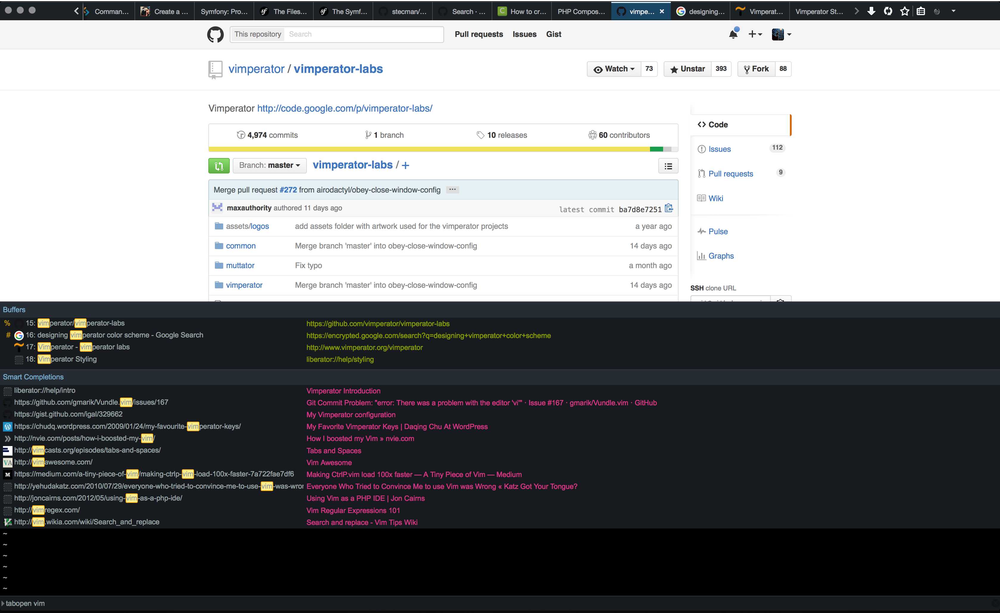

Vimperator Theme: fxdevtools-dark
=================================

This [Vimperator](http://www.vimperator.org/vimperator) color scheme matches
Firefox's dark DevTools / DevEdition theme.

It is still a work in progress.

# Install

- Copy or symlink the `fxdevtools-dark.vimp` file into the `~/.vimperator/colors`
directory.

- Type `:colorscheme fxdevtools-dark` into Vimperator.

- Optionally load it from a `.vimperatorrc` file.

# Author

[Dane MacMillan](https://danemacmillan.com)

# License

MIT
